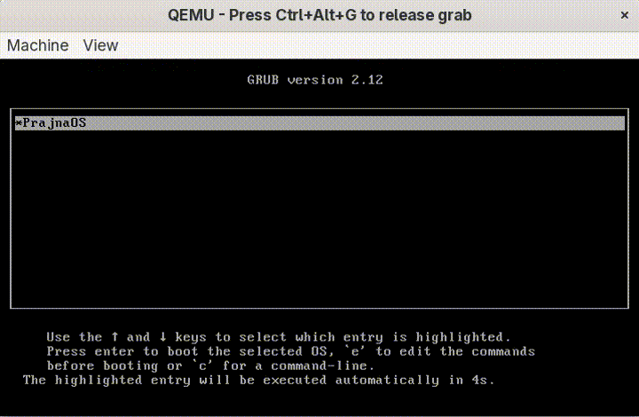

# PrajnaOS

> *Consciousness. Intelligence. Control.*

Experimental x86 operating system written from scratch in C and x86 Assembly,
exploring kernel-level AI inference and autonomous scheduling decisions.

**2,800+ lines** of C and x86 Assembly — no stdlib, no Linux, no external dependencies of any kind.

Built by Raushan Kumar — B.Tech CSE + Data Science, RKGIT, Ghaziabad, India. Entering 3rd year, July 2026.

---

## Demo



---

## Current Status

| Property | Detail |
|---|---|
| Architecture | x86 32-bit protected mode |
| Stage | Level 9 — Week 2 complete |
| Build | Bootable (GRUB2 multiboot) |
| Filesystem | FAT32 (custom driver) |
| Multitasking | Yes — ML-aware scheduler |
| ML Inference | Yes — neural network in kernel space |
| Scheduler | AI-assisted (Prajna kernel) |
| Shell | Interactive, 21 rows |
| License | MIT |

---

## What makes PrajnaOS different

Traditional operating systems rely on hand-designed scheduling policies such as
round-robin, priority scheduling, or heuristic-based schedulers. PrajnaOS explores
using machine learning inference as part of scheduling decisions.

Prajna reads system state, runs neural network inference loaded from disk,
decides which tasks are allowed to run and at what priority, and writes those decisions
into a permission table that the scheduler reads before every context switch.

> AI is not a user-space service. Neural network inference runs directly inside
> the kernel and participates in scheduling decisions.

---

## Project Statistics

```
2,800+  lines of C and x86 Assembly
14      kernel modules
100 Hz  scheduler tick rate
50 ms   Prajna AI cycle interval
20      event log entries (ring buffer)
5,655   ML training samples
32-bit  protected mode
0       external libraries
```

---

## What is already built

| Component | Status |
|---|---|
| Custom bootloader (GRUB2 multiboot) | ✅ |
| GDT + IDT + interrupt handling | ✅ |
| PS/2 keyboard driver | ✅ |
| VGA text mode shell (interactive, 21 rows) | ✅ |
| PIT timer at 100Hz | ✅ |
| ATA PIO disk driver | ✅ |
| FAT32 filesystem — read, write, create, directory traversal | ✅ |
| Physical memory manager (bitmap allocator) | ✅ |
| Kernel heap allocator (kmalloc/kfree) | ✅ |
| Neural network inference in kernel space | ✅ |
| ML weights loaded from FAT32 disk at boot | ✅ |
| Multitasking — context switch, ML-aware scheduler | ✅ |
| Prajna AI kernel — Sense → Think → Act | ✅ |
| ML score → priority tiers (0/1/2) | ✅ |
| Starvation-aware blocking (wait_ticks) | ✅ |
| Anomaly detection per task (z-score history) | ✅ |
| Ring buffer event log (20 decisions) | ✅ |
| Shell commands: prajna status / why / log | ✅ |
| Proactive alerts (memory, starvation, anomaly) | ✅ |
| Live top bar (state, memory, uptime, tasks) | ✅ |
| Kernel stdlib — klib (no external deps) | ✅ |

---

## Architecture

```
Hardware (CPU, RAM, ATA disk, PS/2 keyboard, VGA)
          │
Physical Memory Manager (bitmap allocator)
          │
FAT32 Filesystem (read, write, create, directory traversal)
          │
ML Inference Engine (neural network, weights loaded from disk)
          │
┌─────────────────────────────────────────────┐
│              PRAJNA AI KERNEL               │
│                                             │
│  Sense → Think → Act  (every 50 ticks)     │
│                                             │
│  Inputs:  tick count, free pages,           │
│           task states, ml_scores,           │
│           anomaly history                   │
│                                             │
│  Outputs: task permission (allow/block)     │
│           task priority (0/1/2)             │
│           system state (CALM/NORMAL/ALERT)  │
│           proactive alerts                  │
│           event log (ring buffer)           │
└──────────────────┬──────────────────────────┘
                   │
          AI-aware Scheduler
          (ML score + Prajna priority → combined score)
                   │
          Tasks (shell, kernel services)
                   │
          VGA Shell (interactive, 21 rows)
```

---

## Build history — Levels

| Level | Feature | Status |
|---|---|---|
| L1 | Bootloader + VGA text output | ✅ |
| L2 | GDT + IDT + PS/2 keyboard driver | ✅ |
| L3 | Interactive shell + PIT timer (100Hz) + colors | ✅ |
| L4 | ATA disk driver + FAT32 filesystem + classify command | ✅ |
| L5 | Physical memory manager (bitmap allocator) | ✅ |
| L6 | Multitasking — context switch + round-robin scheduler | ✅ |
| L7 | FAT32 shell — ls, cd, cat, touch, write | ✅ |
| L8 | ML inference in kernel space — neural network from disk | ✅ |
| L9 | AI kernel upgrade — decision-maker, JARVIS voice, self-awareness | 🔄 |

---

## Level 9 — AI Kernel Upgrade (Jun–Jul 2026)

### Week 1 — Decision-maker ✅
| Feature | Detail |
|---|---|
| ML score → priority tiers | ai_think() converts ml_score to 0/1/2 priority, scheduler uses combined score |
| Starvation-aware blocking | wait_ticks counter, forced HIGH priority past threshold, reset on switch |
| Anomaly z-score per task | rolling cpu/mem history, deviation check, priority cap on anomaly |
| Harden task_create() | null-check pmm_alloc(), abort cleanly on out-of-memory |

### Week 2 — Conversational JARVIS ✅
| Feature | Detail |
|---|---|
| Ring buffer event log | 20-entry circular buffer, every Prajna decision recorded |
| prajna status | shell command — live system state from Prajna |
| prajna why | shell command — last decision + which tasks were blocked and why |
| prajna log | shell command — last 5 Prajna decisions |
| Boot-time greeting | Prajna reads system health and reports on boot |
| Proactive alerts | Prajna warns unprompted — low memory, starvation, anomaly |
| Live top bar | Row 0: state, memory, uptime, task count — updates every 10s |

### Week 3 — Self-awareness (Jul 7–10) 🔄
- Predictive memory model — warn before hitting ALERT threshold
- `prajna why` explainability trace
- Confidence score
- Self-check watchdog

### Week 4 — Integration & Polish (Jul 11–20) 📋
- Retrain ML model with richer features
- Personality pass — consistent Prajna voice
- Stress-test demo (many tasks, induced low memory)
- Level 9 documentation

---

## Kernel Design Principles

*Design principles guiding Prajna's decision-making:*

```
1. Never harm the system or its data
2. Obey the operator unless it violates principle 1
3. Protect itself unless it violates principles 1 or 2
4. Never give full control to one task
5. Always maintain a recovery shell
```

---

## ML in Kernel Space

```
PrajnaOS> classify
setosa

PrajnaOS> prajna status
Prajna: CALM - system healthy, all tasks normal

PrajnaOS> prajna why
Last decision: CALM
Blocked tasks: none

PrajnaOS> prajna log
Last 5 Prajna decisions:
CALM  CALM  CALM  CALM  CALM
```

Neural network inference running directly in kernel space —
no OS underneath, no Python, no TensorFlow, no internet.
Weights loaded from FAT32 disk into kernel memory at boot.
Inference runs every 50ms to drive real scheduling decisions.

---

## Screen Layout

```
Row 0   │ PrajnaOS │ CALM │ Mem:130799pg │ Up:340t │ Tasks:1  ← live top bar
Row 1   │ ──────────────────────────────────────────────────  ← divider
Row 2   │                                                      ← shell start
  ...   │   interactive shell (21 rows)
Row 22  │                                                      ← shell end
Row 23  │ [PRAJNA] Warning: ...                               ← proactive alerts
```

---

## Shell Commands

```
help      about     clear     uptime      echo
version   hello     beep      poweroff    reboot
classify  ls        cd        cat         touch
write     prajna status       prajna why  prajna log
```

---

## Kernel Files

```
kernel/
├── kernel.c          — boot sequence, hardware init
├── gdt.c / gdt.asm   — Global Descriptor Table
├── idt.c / idt.asm   — Interrupt Descriptor Table
├── isr.c             — interrupt handlers, keyboard, VGA
├── pit.c             — timer, top bar, scheduler trigger
├── ata.c             — ATA PIO disk driver
├── fat32.c           — FAT32 filesystem driver
├── pmm.c             — physical memory manager
├── scheduler.c       — ML-aware task scheduler
├── heap.c            — kernel heap allocator
├── ai_kernel.c       — Prajna AI core (Sense→Think→Act)
├── klib.c            — kernel stdlib (no external deps)
├── shell.c           — interactive shell + commands
└── ml/
    ├── ml_math.c     — normalize, float utilities
    ├── ml_infer.c    — neural network forward pass
    └── ml_weights.c  — weights loaded from disk
```

---

## Training Dataset

A 5,655-row dataset prepared for Week 4 model retraining:
- 655 rows — real Fedora Linux process samples (collected via systemd service on boot)
- 5,000 rows — synthetic scheduler data (cpu, mem, wait, priority distributions)

Features: `cpu_usage`, `mem_usage`, `wait_time`, `priority` → `score`

---

## Research

**Target:** IEEE ICACCI — *"PrajnaOS: An AI-Centric Bare Metal OS with ML Inference as the Primary Scheduler"*

**Contribution:** Existing ML-assisted scheduling research is commonly implemented
within established operating systems. PrajnaOS explores integrating neural network
inference directly into a custom freestanding kernel with no underlying OS,
no stdlib, and no external libraries.

**SIH 2026:** Foundation for India SHAKTI RISC-V edge AI deployment.

---

## Tech Stack

| Component | Detail |
|---|---|
| Language | C + x86 Assembly (NASM) |
| Compiler | GCC -m32 -ffreestanding -fno-stack-protector |
| Emulator | QEMU qemu-system-i386 |
| Bootloader | GRUB2 multiboot |
| Filesystem | FAT32 (custom driver, no external libs) |
| ML | Custom neural network, weights from FAT32 disk |
| Host OS | Fedora Linux |

---

## Build & Run

```bash
make clean && make && make run
```

Requires: `gcc`, `nasm`, `qemu-system-i386`, `grub2`

---

## Roadmap

### Planned (near-term)
- Predictive memory model — warn before OOM
- `prajna why` explainability trace
- Confidence score on scheduling decisions
- Self-check watchdog for Prajna tick latency
- Model retrain with richer features

### Experimental (longer-term)
- PC speaker + voice/TTS (Stage 4)
- RTL8139 NIC + TCP/IP stack (Stage 5)
- ELF loader + MicroPython (Stage 6)
- SHAKTI RISC-V port
- Adaptive learning from runtime patterns

---

## Attribution

Built by Raushan Kumar ([@mitramaurya80-pixel](https://github.com/mitramaurya80-pixel))  
Ghaziabad, India — B.Tech CSE + Data Science, RKGIT, entering 3rd year July 2026

If you use or reference this work in academic submissions or competitions,
attribution to the original author is requested as a matter of academic integrity.
The full build history with timestamps is publicly verifiable on GitHub.

---

*"Consciousness. Intelligence. Control."*